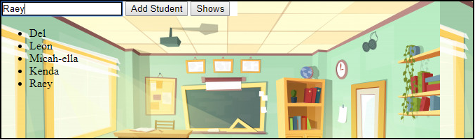

# My Awesome Student List
A Web Application attendance list made with HTML, CSS and JQuery!

## How It's Made:

**Tech used:** HTML, CSS, JQuery

This web application was made using JQuery for functionality. Users are able to input and add names into the attendance list and at the push of a button display those names.

## Lessons Learned:

During the construction of this web application I learned how to use the append method in order to add list items into my empty unordered list on the click of a button.
